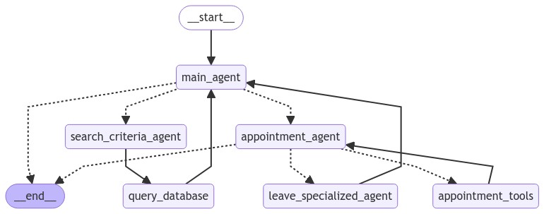

# Real Estate Assistant


Welcome to the AI Agent for Real Estate Professionals. This application is designed to streamline real estate operations, enhancing efficiency through automated communication and task management. The AI agent handles inquiries, schedules appointments, and interacts with clients across multiple platforms, making it an invaluable tool for real estate agents and agencies.

## Key Features

1. **Property Information Inquiry**  
   - Provides detailed property information, including square footage, pricing, condition, and amenities. This ensures potential buyers receive accurate and prompt responses.

2. **Appointment Scheduling**  
   - Integrates with Google Calendar to facilitate the scheduling of property viewings and consultations, allowing clients to book appointments without manual coordination.

3. **Multi-Platform Access**  
   - Accessible through terminal, text messaging, and phone calls, ensuring real-time communication with clients across various channels.

4. **24/7 Availability**  
   - Operates around the clock, ensuring no inquiries go unanswered, reducing missed opportunities, and enhancing client satisfaction.


## Application Workflow



1. **Initialization**  
   - The application starts at the `__start__` node, initiating the AI agent.

2. **Main Interaction Hub**  
   - The `main_agent` node directs users to specific functionalities based on their needs.

3. **Property Inquiry Process**  
   - Users seeking property details are directed to the `search_criteria_agent`, which gathers relevant information and queries the `query_database` for detailed property data.

4. **Appointment Management**  
   - Users looking to schedule appointments are routed through the `appointment_agent`, where they can view and confirm available slots using `appointment_tools`. Specialized needs activate the `leave_specialized_agent` node.

5. **Conclusion of Interaction**  
   - After addressing client needs, interactions return to the `main_agent` for smooth transitions. The workflow ends at the `__end__` node once tasks are completed.

## Usage

1. **Terminal Access**  
   - Follow the on-screen prompts for inquiries and appointment scheduling.

2. **Text Messaging**  
   - Clients can send text messages to the designated number to interact with the AI agent, who will guide them through making inquiries or scheduling appointments.

3. **Phone Interaction**  
   - By calling the provided number, clients can use voice commands to interact with the AI agent, similar to speaking with a human assistant. This supports both property inquiries and appointment management.

## Setup

1. **Install the dependencies**  
   - Run the following command to install required packages:
     ```bash
     pip install -r requirements.txt
     ```

2. **Set up environment variables**  
   - Create a `.env` file in the root directory of the project.
   - Add the necessary environment variables 

3. **Download and set up data**  
   - Download the real estate dataset from [Kaggle](https://www.kaggle.com/datasets/ahmedshahriarsakib/usa-real-estate-dataset) and place it in the `/data` folder.
   - Run `csv_to_sql.py` to convert the CSV file into an SQL database.

4. **Run the main application**  
   - To run the application in the terminal:
     ```bash
     python ai_agent.py
     ```
   - To run the application on a local server for text and call interactions:
     1. Run the `ngrok.exe` file.
     2. Start the server with the following command:
        ```bash
        uvicorn app-retell.server:app --reload
        ```

## Contributing
Contributions are welcome! If you find any issues or have suggestions for improvements, please open an issue or submit a pull request on the GitHub repository.

